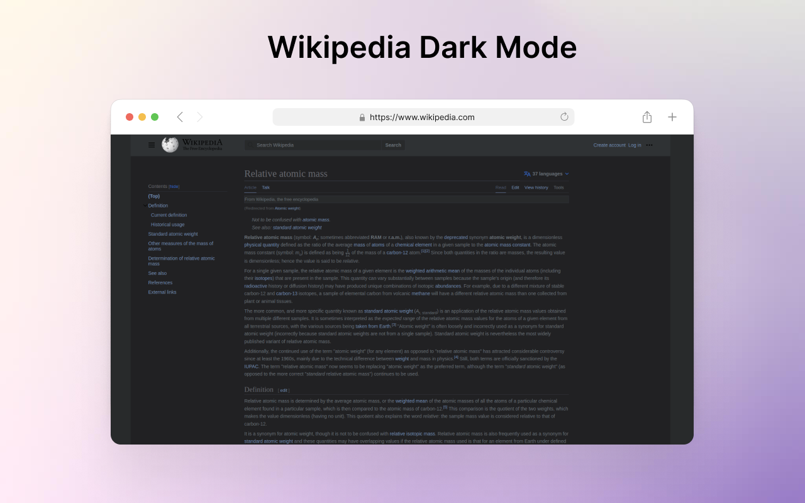

# Wikipedia Dark Mode Chrome Extension

This is a simple Chrome extension that converts Wikipedia pages into a dark mode theme, making it more comfortable for long-term reading. The extension is designed to improve readability and reduce eye strain.

## Installation

The extension is available on the Chrome Web Store: 

To install the extension from GitHub, follow these steps:

1. Download the extension ZIP file from the [Releases](https://github.com/akashvaghela09/wikipedia-dark-mode/releases) page.
2. Unzip the downloaded file to extract the extension folder.
3. Open the Chrome browser and go to `chrome://extensions`.
4. Enable the "Developer mode" toggle in the top right corner.
5. Click on the "Load unpacked" button and select the extracted extension folder.

## Usage

Once the extension is installed, simply navigate to any Wikipedia page, and it will automatically apply the dark mode theme. Enjoy reading Wikipedia articles with a more comfortable and visually appealing look!

## Contributing

Contributions are welcome! If you have any suggestions, bug reports, or feature requests, please feel free to open an issue or submit a pull request.

## License

This project is licensed under the [MIT License](LICENSE).